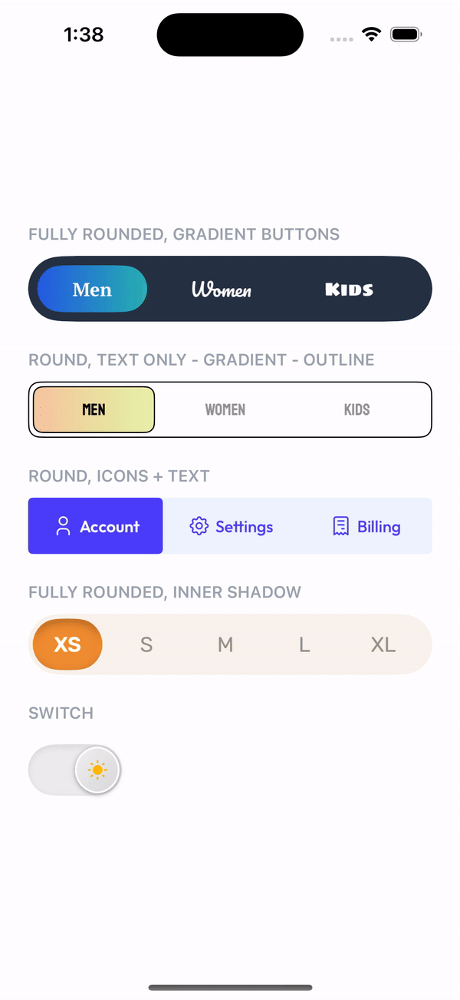

# TTSegmentedControl


[](https://cocoapods.org/pods/TTSegmentedControl)
[](https://cocoapods.org/pods/TTSegmentedControl)
[](http://cocoapods.org/pods/TTSegmentedControl)
[](http://twitter.com/Tapptitude)

## About
An elegant, animated and customizable segmented control for iOS.

This project is maintained by Tapptitude, a mobile app development agency specialized in building high-quality iOS and Android mobile apps, for startups and brands alike. A lively team of skilled app developers and app designers based in Europe, we provide full-stack mobile app development services to entrepreneurs looking to innovate on mobile. 




## Features:
- Variable number of items 
- Animated transition
- Bounce animation
- Fully configurable (color, gradient, shadow, corner radius)
- Designable into Interface Builder

## Requirements

- iOS 13.0+
- Xcode 11+

## Installation

_Swift Package Manager_

```
dependencies: [
    .package(url: "https://github.com/dumitruigor/TTSegmentedControl.git", branch: "swiftPackage")
]
```

_CocoaPods_

```ruby
  pod 'TTSegmentedControl', :git => 'https://github.com/dumitruigor/TTSegmentedControl.git', :branch => 'swiftPackage'
```

_Carthage_

```
github "tapptitude/TTSegmentedControl"
```

_Manually_

Add the TTSegmentedControl to your project.

## Usage

- SwiftUI:

```swift
let titles = ["Title1", "Title2"].map { TTSegmentedControlTitle(text: $0) }

TTSwiftUISegmentedControl(titles: titles, selectedIndex: $selectedIndex)
```

- UIKit:

```swift
let titles = ["Title1", "Title2"].map { TTSegmentedControlTitle(text: $0) }

let segmentedControl = TTSegmentedControl()
segmentedControl.titles = titles
view.addSubview(segmentedControl)
```

## How to customize?

In order to customize the segmented control you'll have to edit it's properties:

```swift
//UIKit
segmentedControl.titleDistribution = .equalSpacing 
segmentedControl.isDragEnabled = true 
segmentedControl.isSizeAdjustEnabled = true
segmentedControl.isSwitchBehaviorEnabled = false
segmentedControl.containerBackgroundColor = .white
segmentedControl.cornerRadius = 15
segmentedControl.padding = .init(width: 2, height: 2)

//SwiftUI
TTSwiftUISegmentedControl(
    titles: titles,
    titleDistribution: .equalSpacing,
    padding: .init(width: 2, height: 2),
    isDragEnabled: true,
    containerBackgroundColor: .white,
    selectionViewColor: .blue,
    cornerRadius: 15,
    isSwitchBehaviorEnabled: false
)
```

You can even disable animation or/and bounce effect:

```swift
//UIKit
segmentedControl.animationOptions = nil 
segmentedControl.bounceAnimationOptions = nil

//SwiftUI
TTSwiftUISegmentedControl(
    titles: titles,
    animationOptions: nil,
    bounceAnimationOptions: nil
)
```

Or you can edit them:

```swift

let animationOptions = TTSegmentedControlAnimationOption(duration: 0.5, options: .curveEaseInOut)
let bounceAnimationOptions = TTSegmentedControlBounceOptions(springDamping: 0.7, springInitialVelocity: 0.2)

//UIKit
segmentedControl.animationOptions = animationOptions
segmentedControl.bounceAnimationOptions = bounceAnimationOptions

//SwiftUI
TTSwiftUISegmentedControl(
    titles: titles,
    animationOptions: animationOptions,
    bounceAnimationOptions: bounceAnimationOptions
)
```

The segmentedControl titles can be customized:

```swift
let title1 = TTSegmentedControlTitle(
    text: "Title 1",
    defaultColor: .black,
    defaultFont: .systemFont(ofSize: 12),
    selectedColor: .white,
    selectedFont: .systemFont(ofSize: 13)
)

let title2 = TTSegmentedControlTitle(
    text: "Title 2",
    defaultColor: .black,
    defaultFont: .systemFont(ofSize: 12),
    selectedColor: .white,
    selectedFont: .systemFont(ofSize: 13)
)

//UIKit
segmentedControl.titles = [title1, title2]

//SwiftUI
TTSwiftUISegmentedControl(titles: [title1, title2])
```

Instead of text the titles can be initialized with NSAttributedString objects:

```swift
let title1 = TTSegmentedControlTitle(
    defaultAttributedText: attributedText1,
    selectedAttributedText: attributedText2
)

let title2 = TTSegmentedControlTitle(
    defaultAttributedText: attributedText3,
    selectedAttributedText: attributedText4
)

//UIKit
segmentedControl.titles = [title1, title2]

//SwiftUI
TTSwiftUISegmentedControl(titles: [title1, title2])
```

You can add image instead of title:


```swift
let title1 = TTSegmentedControlTitle(
    defaultImageName: "default_image_1",
    selectedImageName: "selected_image_1"
)

let title2 = TTSegmentedControlTitle(
    defaultImageName: "default_image_2",
    selectedImageName: "selected_image_2"
)

let title3 = TTSegmentedControlTitle(
    defaultImageName: "default_image_3",
    selectedImageName: "selected_image_3"
)

//UIKit
segmentedControl.titles = [title1, title2, title3]

//SwiftUI
TTSwiftUISegmentedControl(titles: [title1, title2, title3])
```

The image sizes can be customized for each title:


```swift
let title1 = TTSegmentedControlTitle(
    defaultImageName: "default_image_1",
    selectedImageName: "selected_image_1",
    imageSize: CGSize(width: 10, height: 10)
)

let title2 = TTSegmentedControlTitle(
    defaultImageName: "default_image_2",
    selectedImageName: "selected_image_2",
    imageSize: CGSize(width: 30, height: 30)
)

let title3 = TTSegmentedControlTitle(
    defaultImageName: "default_image_3",
    selectedImageName: "selected_image_3",
    imageSize: CGSize(width: 20, height: 20)
)

//UIKit
segmentedControl.titles = [title1, title2, title3]

//SwiftUI
TTSwiftUISegmentedControl(titles: [title1, title2, title3])
```

The texts can be combined with the images:


```swift
let title1 = TTSegmentedControlTitle(
    text: "Facebook",
    defaultImageName: "default_image_1",
    selectedImageName: "selected_image_1",
    imageSize: CGSize(width: 5, height: 5),
    imagePosition: .left
)

let title2 = TTSegmentedControlTitle(
    text: "Youtube",
    defaultImageName: "default_image_2",
    selectedImageName: "selected_image_2",
    imageSize: CGSize(width: 8, height: 8),
    imagePosition: .bottom
)

let title3 = TTSegmentedControlTitle(
    text: "Twitter",
    defaultImageName: "default_image_2",
    selectedImageName: "selected_image_2",
    imageSize: CGSize(width: 8, height: 7),
    imagePosition: .top
)

//UIKit
segmentedControl.titles = [title1, title2, title3]

//SwiftUI
TTSwiftUISegmentedControl(titles: [title1, title2, title3])
```
## Contribution

Feel free to Fork, submit Pull Requests or send us your feedback and suggestions!


## License

TTSegmentedControl is available under the MIT license. See the LICENSE file for more info.
